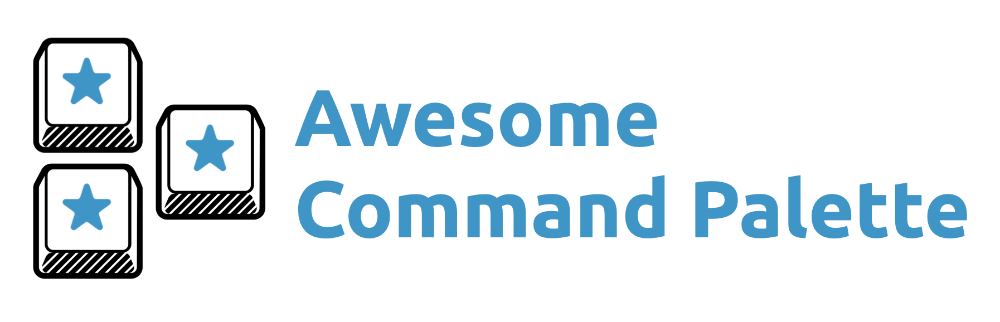

# Awesome Command Palette

> A list of awesome command palette implementations.

## Sites implementing a command palette

- [GitHub](https://github.com) – <kbd>Ctrl / Cmd</kbd> + <kbd>k</kbd>
- [Vercel](https://vercel.com/) – <kbd>Ctrl / Cmd</kbd> + <kbd>k</kbd>
- [Netlify](https://www.netlify.com/) – <kbd>Ctrl / Cmd</kbd> + <kbd>k</kbd> (turn it on in "Netlify Labs" section)
- [Sentry](https://sentry.io) - <kbd>Ctrl / Cmd</kbd> + <kbd>k</kbd>
- [Datadog](https://app.datadoghq.com) - <kbd>Ctrl / Cmd</kbd> + <kbd>k</kbd>
- [CircleCI](https://app.circleci.com) - <kbd>Ctrl / Cmd</kbd> + <kbd>k</kbd>
- [Todoist](https://todoist.com/app/) - <kbd>Ctrl / Cmd</kbd> + <kbd>k</kbd>

## Browser extensions adding a command palette

- [Omni](https://github.com/alyssaxuu/omni) (Chrome extension)
- [hackbar](https://github.com/uier/hackbar) (Chrome extension) for using kbar in HackMD

## Apps implementing a command palette

- [Visual Studio Code](https://code.visualstudio.com/) – <kbd>Ctrl / Cmd</kbd> + <kbd>Shift</kbd> + <kbd>p</kbd>
- [Sublime Text](https://www.sublimetext.com/) – <kbd>Ctrl / Cmd</kbd> + <kbd>Shift</kbd> + <kbd>p</kbd>
- Chrome Developer Tools – <kbd>Ctrl / Cmd</kbd> + <kbd>Shift</kbd> + <kbd>p</kbd>
- [Discord](https://discord.com) - <kbd>Ctrl / Cmd</kbd> + <kbd>k</kbd>
- [Figma](https://figma.com) - <kbd>Ctrl / Cmd</kbd> + <kbd>/</kbd> or <kbd>Ctrl / Cmd</kbd> + <kbd>p</kbd>
- [Linear](https://linear.app) - <kbd>Ctrl / Cmd</kbd> + <kbd>k</kbd>
- [Slack](https://slack.com) - <kbd>Ctrl / Cmd</kbd> + <kbd>k</kbd>
- [Thunderbird](https://www.thunderbird.net/) - <kbd>Ctrl / Cmd</kbd> + <kbd>k</kbd>
- [Spotify](https://spotify.com) - <kbd>Ctrl / Cmd</kbd> + <kbd>k</kbd>
- [PHPStorm / Webstorm / Jetbrains IDEs in general](https://www.jetbrains.com/) - Quick press <kbd>Shift</kbd> twice
- [Arc](https://arc.net/) - A browser having built-in command palette

## Command palette for OS
- [Raycast](https://www.raycast.com/) a blazingly fast, totally extendable launcher (currently MacOS only)
- [Alfred](https://www.alfredapp.com/) a productivity app with lots of custom actions to control your Mac. (MacOS only)
- [Harmonize](https://www.getharmonize.app/) a turbocharged Spotify command palette (MacOS only)

## Libraries

- [kbar](https://github.com/timc1/kbar) – A portable, extensible and React-based -  cmd+k interface for your site.
- [ninja-keys](https://github.com/ssleptsov/ninja-keys) - Keyboard shortcuts interface for your website. Working with static HTML, Vanilla JS, Vue, React, Svelte.
- [react-command-palette](https://github.com/asabaylus/react-command-palette) -  An accessible browser compatible javascript command palette
- [vue-command-palette](https://github.com/xiaoluoboding/vue-command-palette) - A fast, composable, unstyled command palette interface for Vue.
- [scoutbar](https://github.com/adenekan41/scoutbar) - A User-friendly, easy-to-use, scalable, and highly customizable component for automating your command+k experience.
- [kmenu](https://github.com/harshhhdev/kmenu) - An animated and accessible cmd+k interface.
- [cmdk](https://github.com/pacocoursey/cmdk) - Fast, composable, unstyled command menu for React.
- [react-cmdk](https://github.com/albingroen/react-cmdk) – A fast, accessible, and pretty command palette for React.
